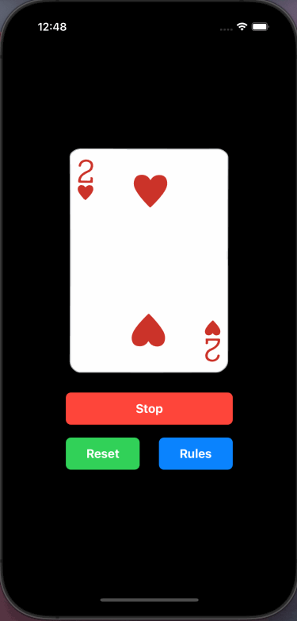

# Card Workout App

Card workout app made in UIKit programmatically 

# RULES

The value of each card represents the number of exerciese you do.\n\nJ = 11, Q = 12, K = 13, A = 14

♠️ = Push Ups\n
❤️ = Sit Ups\n
♣️ = Burpees\n
♦️ = Jumping Jacks\n

